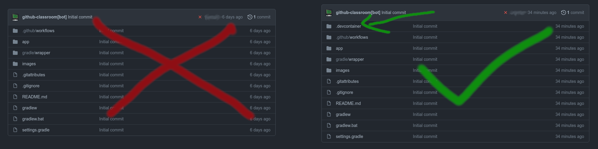
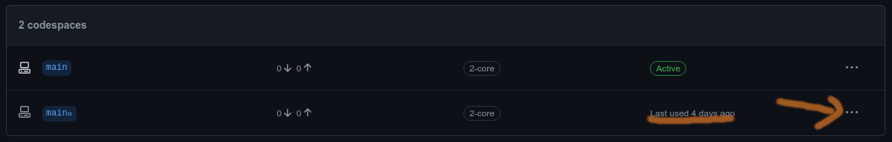

# CS1501 Codespace Setup files
## Codespace container build spec missing from some CS1501 project repos

Some CS1501 project did not include a `.devcontainer` folder by default. If you
are having trouble with your codespace, check to make sure your repo has a
`.devcontainer` folder:



If it does not, you can use this repo to get that setup.

Your `.devcontainer` folder should contain 2 files:

* `devcontainer.json`
* `Dockerfile`

Both of these can be found in the `.devcontainer` folder in this repo. They
serve to set up the Codespaces development environment to match the environment
used by the GradeScope autograder, ensuring that your code runs the same in the
Codespace and on GradeScope. The simplest approach to setting this up would be
to do the following:

1. Start your current codespace.
1. Commit any changes to your repo you want to keep and push them (e.g., any changes to `BST.java`).
1. Run the following command in your Codespace terminal:
	```bash
	curl --proto '=https' --tlsv1.2 -sSf https://raw.githubusercontent.com/PittCS1501/devcontainer1501/main/make_devcontainer.sh | sh
	```
1. Exit the Codespace.
1. Create a *new* Codespace:
	
1. After the new Codespace is up and running, open up the Codespace management:
	
1. And delete the old Codespace to avoid confusion:
	

And that's it! Your new Codespace should be working as intended!
